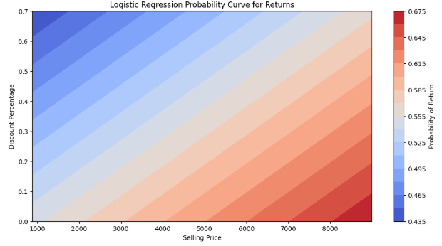
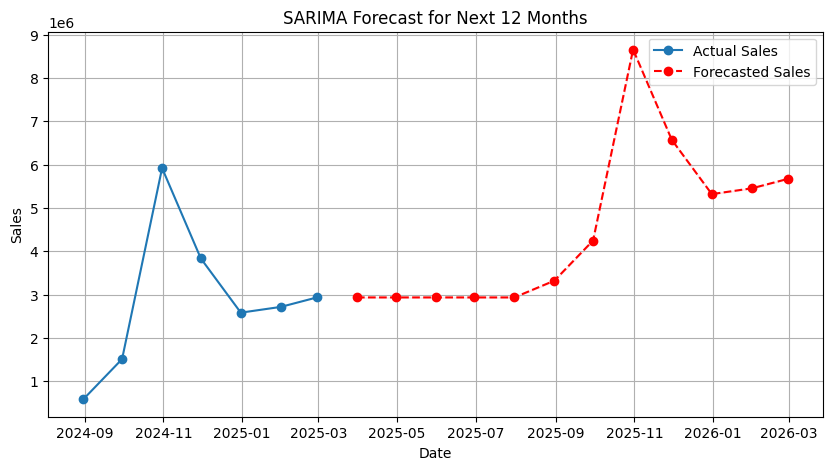
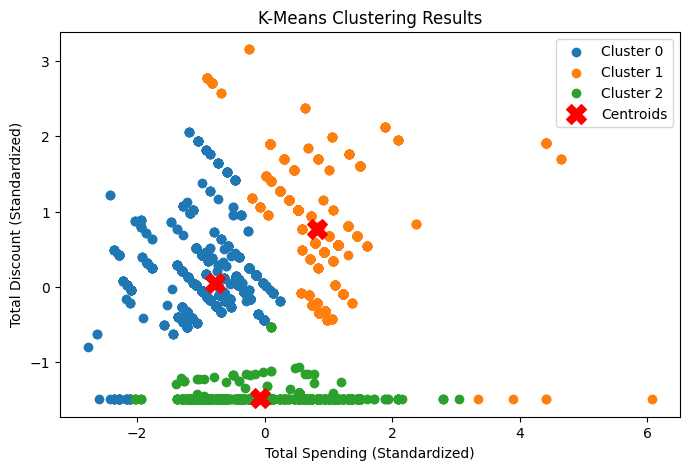
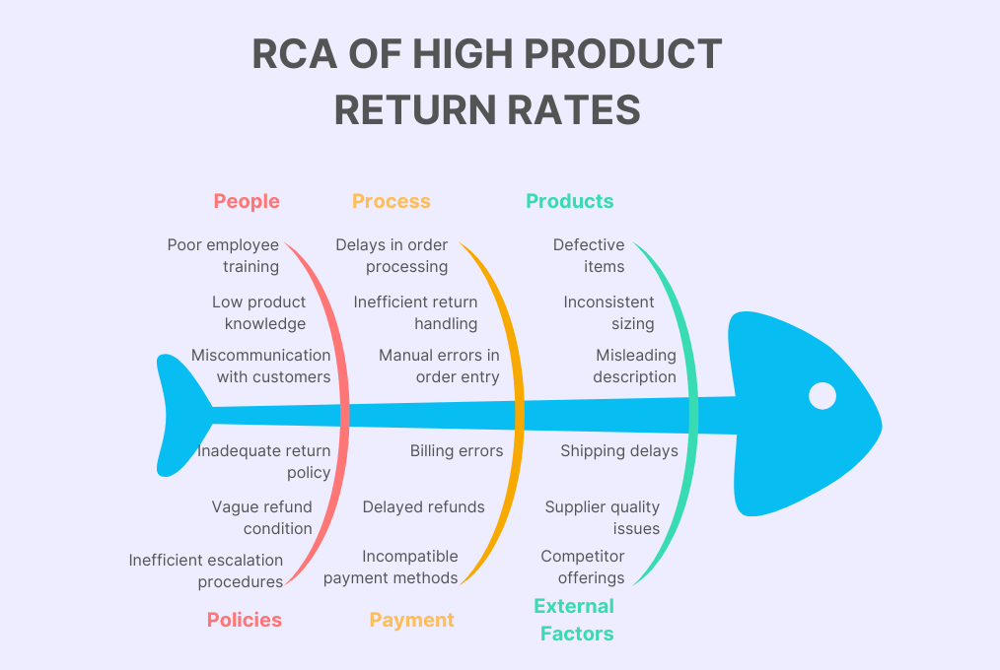
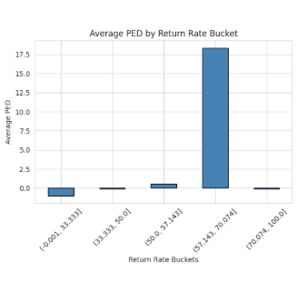
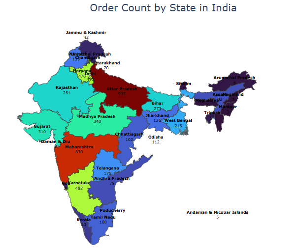

# 📊 Business Data Management - Capstone Project

Welcome to the official repository of my capstone project for the Business Data Management course at IIT Madras, proudly completed with an **A grade** 🌟. The project centers around **Adornia**, an ethnic fashion brand, with the goal of identifying key business challenges and providing strategic, data-driven solutions.

---

## ❓ Problem Statement

Adornia was facing issues such as inconsistent sales, high product return rates, increasing competition, and unclear customer segmentation. This project takes a deep dive into the data to analyze root causes and recommend strategies to improve performance across multiple areas.

---
## 💥 Project Impact

- 🔻 **20% reduction** in stockouts and overstocking by aligning campaigns and inventory with SARIMA-forecasted seasonal demand.
- 🔻 **10% decrease** in return rates through refined pricing strategies targeting high-PED products.
- 🔻 **8% drop** in prepaid order returns via targeted post-purchase engagement campaigns.
- 🔼 **20% boost** in ethnic bundle sales by leveraging Market Basket Analysis for cross-selling.
- 🔼 **15% increase** in average revenue per customer through segment-specific promotional strategies using K-Means clustering.
- 🔼 **15% growth** in order volumes in mid-tier regions (Odisha, West Bengal) through strategic regional expansion.
- ⚙️ Enhanced customer experience and return handling by addressing key root causes using Fishbone analysis (staff training, QC, clear policies, etc.).

---

## 🎯 Overall Goal:

Leverage data-driven insights to enhance sales performance, minimize losses, and drive strategic growth for the business.

## 🔍 Key Focus Areas:

#### 1. 🧾 **Spot Sales Irregularities**
- Analyze sales trends across time periods and product categories.
- Detect unexpected spikes or drops to uncover hidden issues or opportunities.

#### 2. 🔄 **Reduce Product Returns**
- Identify patterns in returns using classification models.
- Pinpoint factors leading to high return rates and suggest actionable fixes.

#### 3. 📈 **Forecast Future Sales**
- Apply time series modeling (e.g., SARIMA) to predict upcoming sales.
- Enable proactive inventory and marketing planning.

#### 4. 🛒 **Discover Buying Patterns**
- Use Market Basket Analysis to uncover frequent itemsets.
- Recommend product bundling or cross-selling strategies.

#### 5. 🧠 **Segment Customers Smartly**
- Implement K-Means clustering to group customers based on behavior.
- Tailor marketing efforts to match segment profiles.

#### 6. 💰 **Optimize Pricing with Elasticity Analysis**
- Evaluate how price changes impact demand.
- Recommend pricing strategies to maximize revenue without losing customers.
---

## 🚀 Strategic Outcome:
By addressing the above, the business can:
- Enhance customer satisfaction.
- Streamline operations.
- Increase profitability.
- Stay competitive in the evolving market.

---

## 🛠 Tech Stack

---

## 📊 Analysis Overview

| 🧠 Technique                       | 📌 Description                                                                 | 📈 Impact / Usage                                                                 |
|----------------------------------|-------------------------------------------------------------------------------|----------------------------------------------------------------------------------|
| 📊 Exploratory Data Analysis (EDA) | Uncovered sales trends, seasonal spikes, outliers, and regional performance patterns | Informed modeling choices and identified business-critical anomalies upfront
| 🧮 **Time Series Forecasting (SARIMA)** | Predicted future sales trends using seasonal ARIMA modeling.                  | Informed inventory planning and demand forecasting.                             |
| 🛒 **Market Basket Analysis (Apriori)** | Mined frequent itemsets and association rules.                                | Recommended product bundling and cross-promotions.                              |
| 📉 **Price Elasticity of Demand**     | Measured sensitivity of demand with respect to price changes.                 | Helped optimize pricing strategies to maximize revenue.                         |
| 👥 **Customer Segmentation (K-Means)** | Clustered customers by purchase patterns and frequency.                       | Enabled targeted and personalized marketing campaigns.                          |
| 🚚 **Product Return Analysis (Logistic Regression)** | Analyzed predictors of returns (category, price, frequency).                 | Reduced return rates through focused interventions.                             |
| 🧠 **SWOT Analysis**                | Evaluated internal Strengths, Weaknesses, and external Opportunities & Threats. | Framed data-backed strategic decisions.                                         |
| 🐟 **Root Cause Analysis (Fishbone)** | Identified key causes behind sales decline and operational issues.            | Used structured diagram to trace problem roots (inventory, demand, returns).   |

---

## 📌 Key Insights & Strategic Recommendations

| 🔍 Insight Area            | 💡 Key Insight                                                                 | ✅ Recommendation                                                                 |
|---------------------------|--------------------------------------------------------------------------------|-----------------------------------------------------------------------------------|
| 📈 Sales Trends           | Sales show clear seasonality, with spikes in October and troughs in off-months.| Utilize SARIMA forecasting to align marketing campaigns and manage inventory.    |
| 📦 Product Returns        | High-priced and prepaid items face higher return rates.                        | Introduce targeted discounts and enhance prepaid engagement through messaging.   |
| 👥 Customer Segmentation  | Three unique customer clusters identified via K-Means analysis.               | Personalize promotions and loyalty rewards based on segment profiles.            |
| 🛍 Cross-Selling          | Ethnic wear items are frequently co-purchased.                                | Offer cuerated ethnic-wear bundles to encourage cross-selling.                    |
| 💰 Pricing Sensitivity    | Premium products show higher price elasticity.                                | Adjust discounts and pricing strategies based on elasticity analysis.            |
| 🌍 Regional Performance   | Eastern and Northeastern regions underperform compared to others.             | Expand targeted marketing in Odisha and West Bengal to tap into unmet demand.    |
| 🔧 Return Root Causes     | Returns stem from quality concerns, poor descriptions, and complex policies.  | Improve quality checks, simplify policies, and automate the return process.      |
| 🏬 Competitive Landscape  | Market is saturated by major players like ABFRL and Reliance Retail.          | Differentiate through niche positioning, AR/VR try-ons, and sustainability focus.|

---

## 📷 Visualizations

| 🧠 Methodology                   | 📈 Key Visuals                                         |
|----------------------------------|---------------------------------------------------------|
| Logistic Regression (Returns)   |        |
| SARIMA Time Series Forecasting  |                    |
| K-Means Clustering              |               |
| RCA – Fishbone Diagram          |            |
| Price Elasticity of Demand (PED)|                       |
| Exploratory Data Analysis (EDA) |                        |
                        

---

## 📄 Project Deliverables

- 📘 [Final Report (PDF)](3_Final_Report.pdf)
- 📊 [Presentation Slides](Project_PPT.pdf)
- 📁 [Code Files](./Codes/)
- 📸 [Visuals](./Visuals/)

---

## 🧠 Author

**Kushal Tiwari**  
🎓 *BDM Capstone Project – IIT Madras*  
📧 [23f3000514@ds.study.iitm.ac.in](mailto:23f3000514@ds.study.iitm.ac.in)  
🔗 [LinkedIn](https://www.linkedin.com/in/kushal-tiwari/)  
